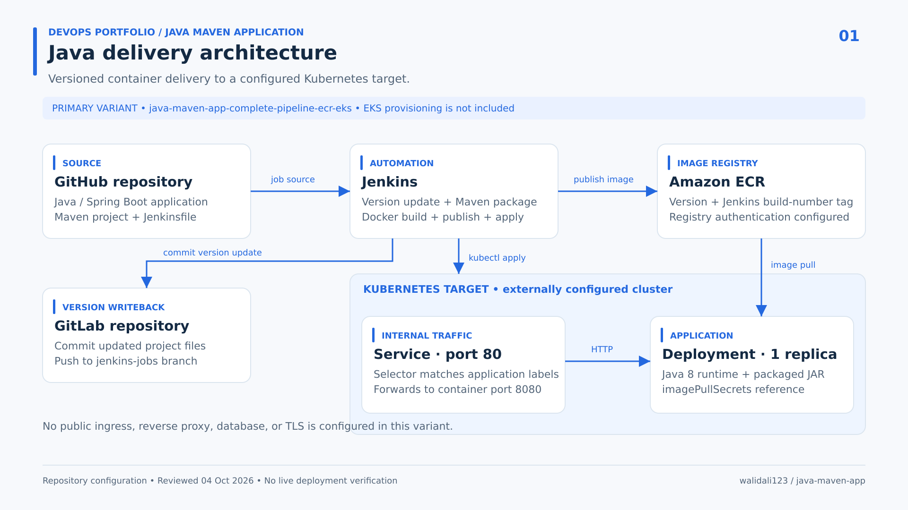
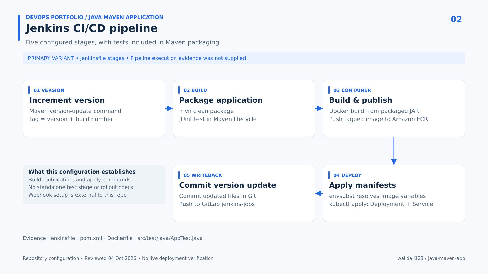
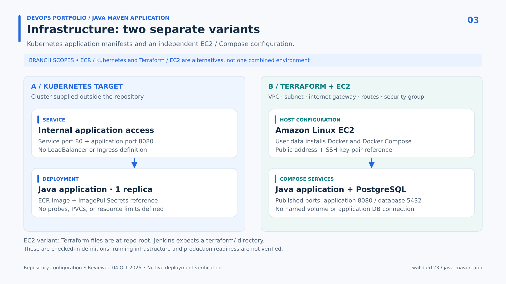
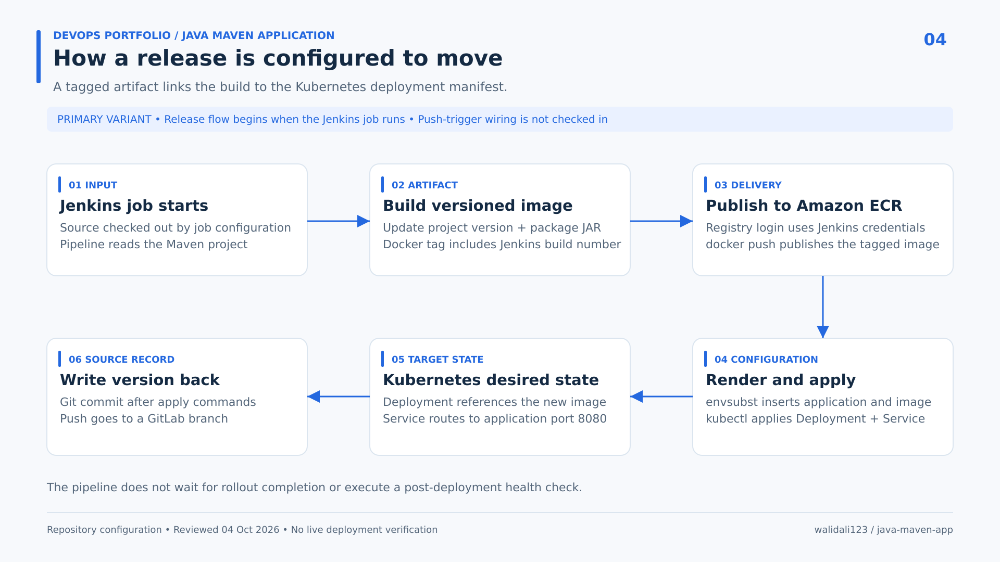
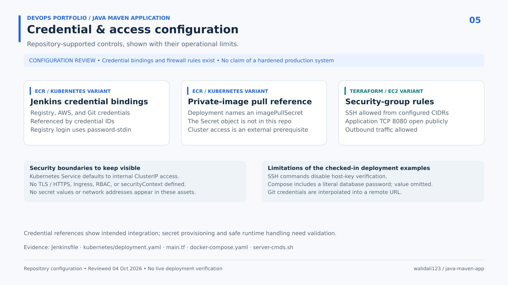

# Java DevOps Portfolio

### Jenkins CI/CD · Docker · Amazon ECR · Kubernetes

A DevOps case study showing how a Java application is packaged, published as a versioned container image, and configured for deployment to Kubernetes. Separate branches explore Terraform infrastructure and Docker Compose deployment on Amazon EC2.

**Focus:** build automation, container delivery, deployment configuration, and infrastructure as code.

[Architecture](#architecture) · [CI/CD](#cicd) · [Infrastructure](#infrastructure) · [Deployment](#deployment-flow) · [Security](#security) · [Evidence](portfolio/devops/EVIDENCE.md)

## Overview

The primary implementation is on the [`java-maven-app-complete-pipeline-ecr-eks`](https://github.com/walidali123/java-devops-jenkins-docker-kubernetes/tree/java-maven-app-complete-pipeline-ecr-eks) branch. Its Jenkinsfile defines five stages: version update, Maven packaging, Docker image publication, Kubernetes manifest application, and Git version writeback.

The application is a small Java/Spring Boot web application used as the deployment workload. This portfolio documents the DevOps configuration. Diagrams describe checked-in commands and intended relationships; a successful live production deployment was not verified.

| Area | Repository-supported work |
|---|---|
| Build automation | Maven packaging with a basic JUnit test |
| Container delivery | Java Dockerfile, version/build-number tags, Amazon ECR publication |
| Kubernetes | Parameterized Deployment and internal Service manifests |
| Infrastructure as code | Separate Terraform definitions for AWS networking and EC2 |
| Server deployment | Separate SSH/SCP and Docker Compose configuration |

## Architecture

Jenkins packages the application, builds and publishes its image to Amazon ECR, and applies Kubernetes templates with resolved application and image values. The Deployment defines one replica; an internal Service forwards port 80 to container port 8080.

The registry, cluster access, and referenced image-pull Secret must be supplied externally. The branch name mentions EKS, but the repository does not establish cluster identity or provision an EKS cluster. No public ingress or HTTPS endpoint is configured in this variant.

## CI/CD

| Stage | Configured action |
|---|---|
| 1. Increment version | Update the Maven version and derive an image tag using the Jenkins build number |
| 2. Build application | Run `mvn clean package`; a basic JUnit test is included in the Maven lifecycle |
| 3. Build and publish image | Build the Docker image, authenticate, and push its tag to Amazon ECR |
| 4. Apply deployment | Resolve manifest variables with `envsubst` and submit resources using `kubectl apply` |
| 5. Record version update | Commit project changes and push to the configured GitLab branch |

Jenkins job setup, credentials, tools, checkout configuration, and any webhook are external prerequisites. The test checks a Java method; it is not an HTTP health check. Git writeback targets GitLab, while the portfolio and reviewed source are hosted on GitHub.

## Infrastructure

### Kubernetes variant

The primary branch contains a single-replica Deployment with a Java container, an ECR image reference, and an image-pull Secret reference. Its Service uses matching application labels and provides internal routing. No database container, persistent volume, Ingress, or cluster provisioning is defined in this variant.

### Terraform / EC2 variant

The separate [`feature-sshagent-terraform-jenkins-integeration`](https://github.com/walidali123/java-devops-jenkins-docker-kubernetes/tree/feature-sshagent-terraform-jenkins-integeration) branch contains:

- Terraform definitions for a VPC, subnet, internet gateway, route table, security group, and EC2 instance.
- Amazon Linux startup commands to install Docker and Docker Compose.
- SSH/SCP deployment commands and a Compose stack containing the Java application and PostgreSQL.

The Compose file publishes application and database ports but defines no named volumes or application datasource connection. This branch is an independent deployment example. Its Jenkinsfile expects a `terraform/` directory while the Terraform files are at the branch root; it also depends on an external shared library. These integration details require validation before an end-to-end execution claim.

## Deployment Flow

When the configured Jenkins job runs, it updates the project version, packages the application, and publishes a tagged image. The pipeline inserts that image reference into the Kubernetes Deployment template and applies the Deployment and Service. Git writeback follows the apply commands.

The pipeline does not wait for a completed rollout or run a post-deployment health check. The flow therefore demonstrates configured delivery steps, rather than verified application availability.

## Security

The checked-in examples include Jenkins credential bindings, registry login with `--password-stdin`, a Kubernetes image-pull Secret reference, and Terraform SSH access rules using configured CIDRs.

The security visual also records their limits: no TLS setup, SSH commands that disable host-key verification, credential interpolation, and a literal database password in the Compose example. Secret values and network addresses are omitted from this portfolio. These controls are presented as configuration evidence, rather than a production-hardening claim.

## Technologies

| Scope | Technologies |
|---|---|
| Primary delivery pipeline | Jenkins, Groovy, Maven, Docker, Amazon ECR, Kubernetes, Git, shell, `envsubst` |
| Application / test context | Java 8, Spring Boot, JUnit |
| Separate EC2 deployment example | Terraform, AWS VPC/network resources, Amazon EC2, Amazon Linux, Docker Compose, Docker Hub, PostgreSQL, SSH/SCP |
| Supplemental branch examples | Jenkins Shared Library integration, Ansible, Sonatype Nexus |

Startup logging is present in the application. No centralized logging or monitoring stack is configured. The separate nginx deployment demo is not an application reverse-proxy configuration.

## DevOps Responsibilities

The repository provides evidence of configuration in these areas:

- Maven packaging and container image publication in Jenkins.
- Version-based image naming and Git version writeback.
- Java application containerization.
- Parameterized Kubernetes Deployment and Service definitions.
- Credential bindings and private-image pull integration references.
- Terraform network/EC2 definitions and SSH/Compose deployment commands in a separate branch.

These are repository-supported capabilities; individual authorship is not established by this review. Application-development credit is outside the scope of this case study.

## Project Results

- A checked-in five-stage pipeline defines the primary release sequence.
- A Dockerfile and Kubernetes templates connect the packaged application to its runtime image and service route.
- A separate branch documents an EC2/Compose approach with Terraform infrastructure definitions.
- A committed test report in the Terraform branch records one test with no failures or errors. It is historical output, not a fresh test result or proof of the primary pipeline run.

No live cloud deployment, production uptime, performance improvements, or zero-downtime results are claimed. The [evidence audit](portfolio/devops/EVIDENCE.md) records the exact reviewed commits, source references, external prerequisites, and configuration gaps.

## Portfolio Files

| File | Purpose |
|---|---|
| [Case-study README](portfolio/devops/README.md) | Self-contained documentation beside the portfolio assets |
| [Upwork portfolio copy](portfolio/devops/UPWORK.md) | Project title, overview, responsibilities, features, and suggested skills |
| [Branch audit and evidence](portfolio/devops/EVIDENCE.md) | Seven-branch inventory and immutable source references |
| [PNG and SVG visuals](portfolio/devops/) | Five 1920 × 1080 images and editable SVG counterparts |
| [Diagram generator](portfolio/devops/source/generate_visuals.py) | Reproducible diagrams built with Python and Inkscape |

Reviewed across seven branch tips on **4 October 2026**. Presentation changes do not modify the application or deployment implementation.
